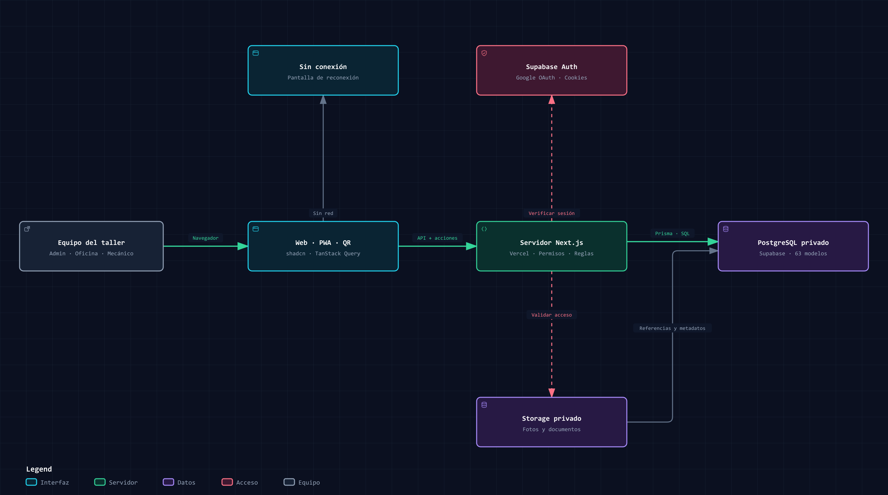

# Mecanismos Manager

<p align="center">
  
</p>

Aplicación de gestión para Mecanismos Técnicos, un taller de Bogotá dedicado a sistemas de inyección diésel, motores diésel y transmisiones automáticas. Reúne el trabajo del taller, las ventas, el inventario, el dinero y la administración del equipo.

[Aplicación](https://mecanismos.andres-duque.com) · [Diagramas](docs/diagrams/README.md) · [Modelo de datos](prisma/schema.prisma)

## Funcionalidades

| Área | Operaciones |
| --- | --- |
| Órdenes y tareas | Reparación, reconstrucción propia o venta de mostrador desde una misma sección. Responsable y tareas iniciales al crear la orden; lista y kanban, fotos, observaciones, tiempos, pruebas y entrega. |
| Clientes y ventas | Historial por cliente y vehículo, cotizaciones, aprobación, ventas de mostrador, abonos, cartera y devoluciones. |
| Inventario y proveedores | Repuestos nuevos, usados y reconstruidos; referencias, categorías, existencias por sede, reservas, traslados, conteos, compras y precios por proveedor. |
| Servicios | Catálogo de servicios y clasificación por categoría, separado de los repuestos físicos. |
| Dinero | Cuentas, cobros, pagos, gastos recurrentes, obligaciones, transferencias entre cuentas y cierres. |
| Equipo | Salarios, bonos, horas extra, permisos, vacaciones, anticipos en cuotas y pagos de nómina. Asistencia con QR dinámico y horario configurable, incluido el sábado. |
| Rentabilidad | Resultados por categoría, servicio, repuesto y empleado; costos de mano de obra, garantías y cobertura de los gastos del mes. |
| Organización | Notas y pendientes personales o generales para oficina y administración. Calendario de entregas, eventos y pendientes programados. |
| Seguimiento | Autor de los cambios, historial de modificaciones y avisos a administración cuando oficina modifica Dinero o Equipo. |

La configuración inicial contempla dos sedes, moneda COP y zona horaria `America/Bogota`.

## Recorridos de trabajo

Una reparación puede empezar con una cotización o con la recepción del vehículo o componente. El cliente se asigna al crear el registro y puede darse de alta desde el mismo formulario. La orden conserva el diagnóstico y la ejecución; la venta reúne lo que se cobra y los pagos se aplican a su saldo.

En mostrador se puede registrar una venta y cobrarla completa o recibir abonos. Los movimientos de dinero actualizan las cuentas y la cartera. Una transferencia entre cuentas conserva el saldo total de la empresa.

La entrega de una reparación requiere las comprobaciones y la constancia de entrega correspondientes. El estado del trabajo y el saldo por cobrar se registran por separado. La reconstrucción de unidades propias conserva sus costos hasta su venta.

Las pestañas de Órdenes reúnen reparaciones, ventas y cotizaciones. Al crear una orden se elige su tipo: una reparación solicita recepción, responsable y tareas; una venta solicita líneas, precios y forma de pago. Los documentos comerciales conservan su historial y sus controles de inventario y dinero.

El responsable de una reparación puede asignarse aunque todavía no tenga tareas. Las tareas iniciales se guardan junto con la orden, con sus empleados y minutos previstos. El kanban usa las mismas reglas que el cambio de estado desde el detalle: terminar tareas, aprobar pruebas y registrar la entrega cuando corresponda.

Las fechas de ingreso y cierre se registran automáticamente. La mano de obra se registra por tarea y empleado en **Detalle de orden → Registrar tiempo trabajado**; oficina puede cargar el tiempo de un mecánico y la auditoría identifica a quien lo ingresó. El total incluye horas extra vinculadas a tareas y excluye bonos de importe fijo. La permanencia en el taller no se convierte automáticamente en tiempo productivo.

Las notas y pendientes personales solo son visibles para su autor, incluso frente a otros administradores. Los generales se comparten entre oficina y administración; la eliminación de registros generales queda reservada a administración. Un pendiente con **Añadir a calendario** se muestra usando el mismo registro: editarlo, completarlo o eliminarlo actualiza ambas vistas. El calendario muestra entregas de órdenes abiertas, eventos y pendientes programados en hora de Bogotá. Estos módulos no están disponibles para mecánicos, tampoco mediante la API.

Las notas admiten títulos, formato de texto, listas, casillas, enlaces y hasta cinco imágenes. El contenido se valida como un documento estructurado; las imágenes se convierten a WebP y se guardan en el bucket privado existente. Cada lectura comprueba los permisos de la nota. Las vistas de mes, semana y agenda comparten los mismos eventos.

Las categorías se crean desde los selectores de órdenes, inventario y servicios, con normalización para evitar duplicados; no requieren una sección de Configuración.

## Arquitectura



Next.js sirve la interfaz, las rutas API y las acciones del servidor. TanStack Query organiza las consultas y mutaciones por funcionalidad. Prisma accede a PostgreSQL con un rol limitado; Supabase proporciona autenticación con Google y almacenamiento privado.

| Capa | Tecnología |
| --- | --- |
| Aplicación | Next.js 16.3, React 19, TypeScript |
| Interfaz | Tailwind CSS 4, shadcn/ui con Radix, Recharts, dnd-kit |
| Estado remoto | TanStack Query 5 |
| Persistencia | PostgreSQL 17, Prisma 7, migraciones SQL de Supabase |
| Acceso y archivos | Supabase Auth, Google OAuth, Supabase Storage |
| Despliegue | Vercel, conectado a GitHub |
| Instalación móvil | Manifiesto PWA y service worker |

El esquema privado `workshop` contiene 64 modelos. Las restricciones contables, los movimientos de inventario y la auditoría se refuerzan mediante restricciones y funciones SQL. [Los cinco diagramas](docs/diagrams/README.md) incluyen arquitectura, datos, reparación, dinero y reconstrucción propia.

## Roles y acceso

| Rol | Acceso |
| --- | --- |
| Administración | Operación completa, rentabilidad, configuración, permisos de acceso y acciones de eliminación o anulación reservadas. |
| Oficina | Clientes, órdenes, ventas, proveedores, inventario, Dinero y Equipo. Puede registrar y editar; las acciones reservadas a administración se rechazan también en el servidor. |
| Mecánico | Órdenes y tareas asignadas, observaciones, fotos, tiempos y registro de jornada. |

El primer ingreso con Google vincula el correo verificado a un miembro activo previamente autorizado. El rol se consulta en la base del taller. Los datos del perfil de Google se usan para mostrar la fotografía; no conceden permisos.

## Desarrollo local

El entorno de referencia usa **Windows, PowerShell, Node.js 24, pnpm 11.5.2 y Docker Desktop**. Los scripts de preparación local invocan `pnpm.cmd`.

### 1. Instalar y preparar la base

```powershell
git clone https://github.com/DukkeA/mecanismos-manager.git
cd mecanismos-manager
pnpm install --frozen-lockfile
pnpm dlx supabase@2.116.0 start -x realtime,imgproxy,studio,edge-runtime,logflare,vector,supavisor
pnpm dlx supabase@2.116.0 migration up --local
node scripts/setup-local.mjs
pnpm db:generate
```

`setup-local.mjs` crea `.env.local` con un usuario de base de datos dedicado y conserva el archivo si ya existe. La API local usa el puerto **56321**, PostgreSQL **56322** y el servidor de desarrollo **3100**.

### 2. Cargar escenarios de prueba

```powershell
pnpm db:seed:local
pnpm db:storage:local
pnpm db:migrate:photos:local
pnpm db:seed:commerce
pnpm db:seed:control
pnpm db:seed:team
pnpm db:seed:attendance
pnpm db:seed:benefits
pnpm db:seed:payroll
pnpm db:seed:supports
pnpm db:seed:categories
```

Estos comandos incluyen clientes y proveedores ficticios, órdenes en distintos estados, pagos parciales, existencias, gastos, asistencia y novedades del personal. Las cargas están restringidas a la instancia local. No se ejecutan durante el despliegue.

La carga inicial prepara perfiles de administración, oficina y mecánico. Para usarlos, `LOCAL_TEST_ACCESS=true` debe estar en `.env.local`. Este acceso se desactiva en Vercel y solo funciona con los puertos locales del proyecto.

### 3. Ejecutar

```powershell
pnpm dev
```

Abrir [localhost:3100/login](http://localhost:3100/login) y elegir un perfil. Los datos de prueba persisten en Docker.

### 4. Verificar

```powershell
pnpm test
pnpm typecheck
pnpm db:seed:organizer # Opcional: notas y pendientes ficticios, solo en Docker local
pnpm db:validate
pnpm db:verify:fixtures
pnpm test:integration
pnpm build
```

Las pruebas unitarias no requieren Docker. Las pruebas de integración y la verificación de escenarios sí requieren la base local preparada. Con la app en ejecución, `pnpm test:access` comprueba los perfiles locales por HTTP.

## Variables de entorno

[.env.example](.env.example) documenta los nombres. Guardar los valores locales en `.env.local` y los del despliegue en Vercel.

| Variable | Uso |
| --- | --- |
| `DATABASE_URL` | Conexión del servidor mediante el rol `workshop_runtime`. En cloud, usar el pooler de Supabase en modo transacción. |
| `DATABASE_SSL_CA` | Certificado CA de Supabase en formato PEM para verificar TLS. Vacío en Docker local. |
| `NEXT_PUBLIC_SUPABASE_URL` | URL de la API del proyecto Supabase. |
| `NEXT_PUBLIC_SUPABASE_PUBLISHABLE_KEY` | Clave publicable del mismo proyecto. |
| `SUPABASE_SECRET_KEY` | Clave exclusiva del servidor para Storage privado. |
| `NEXT_PUBLIC_APP_URL` | Origen de la aplicación y base de las redirecciones de acceso. |
| `GOOGLE_AUTH_ENABLED` | `true` después de configurar el proveedor Google. |
| `LOCAL_TEST_ACCESS` | `true` solo para los perfiles ficticios de Docker. |
| `APP_ENVIRONMENT` | Identificación operativa del entorno: `local`, `test` o `production`. |

Los secretos, respaldos, credenciales de CLI y archivos generados no se versionan. Una clave secreta de Supabase nunca debe tener el prefijo `NEXT_PUBLIC_`.

## Despliegue

### Base de datos y archivos

1. Crear un proyecto Supabase y aplicar las migraciones de `supabase/migrations` a ese proyecto.
2. Ejecutar `supabase/bootstrap.sql` para crear sedes y cuentas con saldo cero. El script conserva registros existentes y no carga escenarios ficticios.
3. Autorizar al primer administrador mediante una inserción en `workshop."Member"`, usando su correo real de Google. Después, gestionar los demás accesos desde Equipo:

```sql
-- Sustituir el correo y el nombre antes de ejecutar.
INSERT INTO workshop."Member" (id, email, name, role)
VALUES (gen_random_uuid(), 'admin@example.com', 'Administrador', 'ADMIN')
ON CONFLICT (email) DO NOTHING;
```

4. Habilitar `LOGIN` para `workshop_runtime` con una contraseña propia. Conservar sus permisos limitados y usar esa conexión en `DATABASE_URL`; reservar el usuario de administración para las migraciones.
5. Crear el bucket privado `workshop-documents`: límite de **3 MiB**, tipos `image/jpeg`, `image/png`, `image/webp` y `application/pdf`.
6. Configurar las variables del servidor en Vercel, incluido el certificado de Supabase para TLS.

PostgreSQL guarda las referencias y metadatos de los adjuntos. El servidor valida sesión y permisos en cada subida y descarga. Los respaldos de PostgreSQL y de los objetos de Storage deben prepararse por separado.

### Google OAuth

En GCP, crear un cliente OAuth de tipo **Aplicación web** y configurar:

| Campo | Valor |
| --- | --- |
| Origen de JavaScript | `https://tu-dominio` |
| URI de redirección de Google | `https://<project-ref>.supabase.co/auth/v1/callback` |

Guardar el Client ID y Client Secret en **Supabase → Authentication → Providers → Google**. En **URL Configuration**, usar `https://tu-dominio` como Site URL y autorizar `https://tu-dominio/auth/callback`.

Google devuelve la autenticación a Supabase; Supabase la devuelve a la app. En modo Testing de GCP, añadir también los correos autorizados como usuarios de prueba. [Documentación de Google OAuth con Supabase](https://supabase.com/docs/guides/auth/social-login/auth-google).

### Vercel y GitHub

Importar `DukkeA/mecanismos-manager`, seleccionar **Next.js**, usar la raíz del repositorio y **Node.js 24**. Configurar las variables para Production, establecer `main` como rama de producción y asignar el dominio.

El proyecto utiliza `pnpm@11.5.2`; `ENABLE_EXPERIMENTAL_COREPACK=1` habilita esa versión en el entorno de compilación utilizado. El comando de construcción es `pnpm build`. Las migraciones se aplican de forma controlada antes de publicar código que dependa de ellas; no se ejecutan en cada build.

Los cambios en `main` generan un despliegue. Las ramas de trabajo pueden generar previews; sus variables y base de datos deben configurarse por separado.

## PWA y límites actuales

La PWA utiliza el mismo backend de Next.js. El service worker se registra en producción y conserva la pantalla sin conexión y recursos estáticos. Las respuestas privadas y las escrituras no se almacenan para operar sin red.

La app incluye manifiesto, iconos y registro de jornada mediante cámara. La instalación y los permisos de cámara deben comprobarse en los dispositivos del taller. No se distribuye una APK firmada.

Los registros de dinero y personal apoyan la gestión interna. No hay integración automática con Siigo ni emisión de facturación electrónica.

## Estructura del repositorio

```text
src/app/           Páginas, rutas API y acciones del servidor
src/features/      Interfaces, consultas y mutaciones por funcionalidad
src/components/    Componentes compartidos y primitivas shadcn/ui
src/domain/        Reglas de negocio, cálculos y contratos
src/server/        Autenticación, servicios y persistencia
prisma/            Esquema del cliente Prisma
supabase/          Configuración local, migraciones y arranque sin operaciones
scripts/           Preparación local, escenarios y verificaciones
tests/             Pruebas de integración
docs/diagrams/     Fuentes Archify, visores HTML e imágenes
public/            Marca, iconos y recursos de la PWA
```

## Cambios y mantenimiento

Trabajar en ramas `feature/*`, `fix/*` o `chore/*`, agrupar cambios en commits revisables y ejecutar las verificaciones correspondientes antes de integrar en `main`. Una modificación de base de datos debe incluir su migración SQL y la actualización del esquema Prisma.

Conservar el historial de movimientos y auditoría. Los reinicios de bases de prueba y las restauraciones son operaciones explícitas; no forman parte del arranque ni del despliegue.
