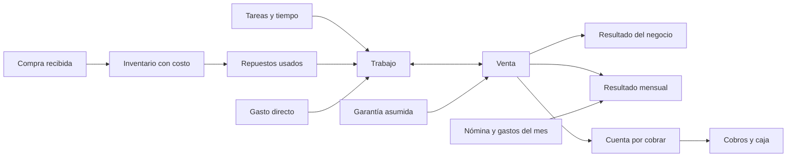
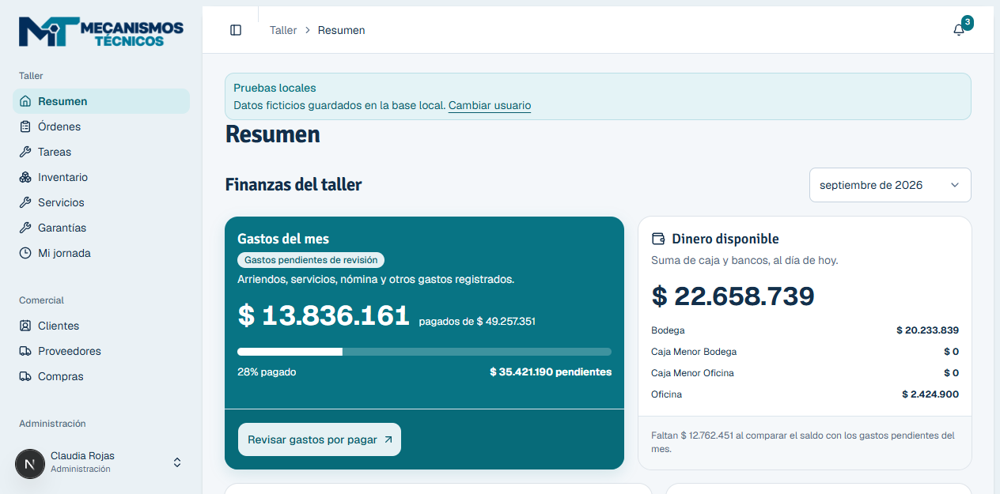
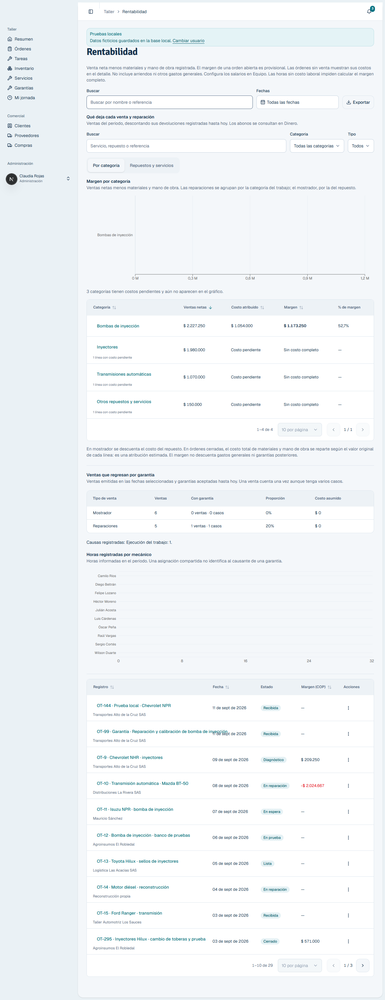
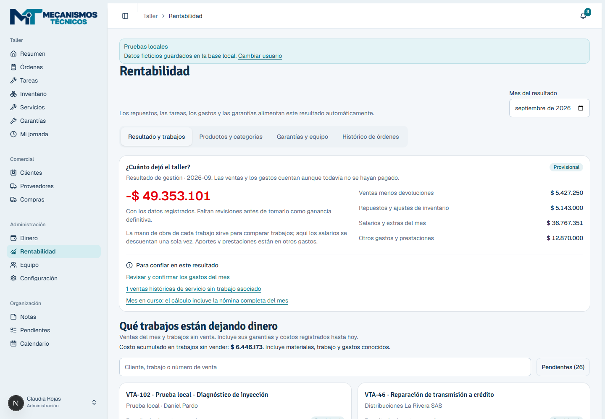
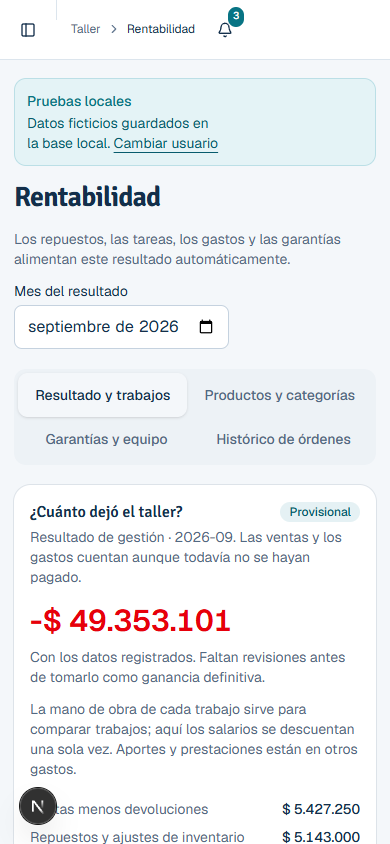
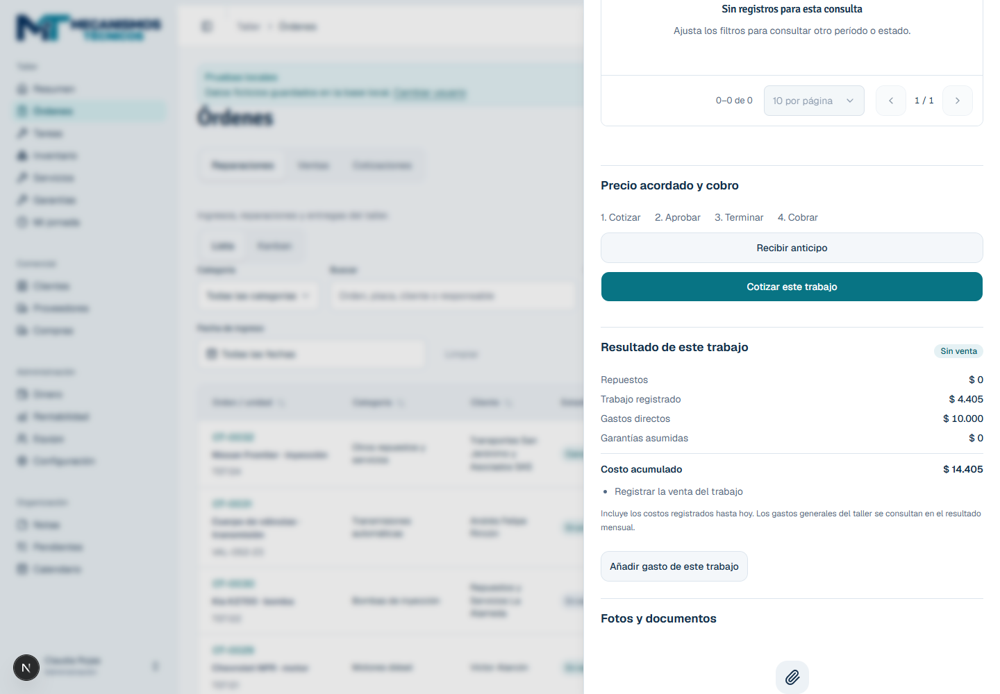
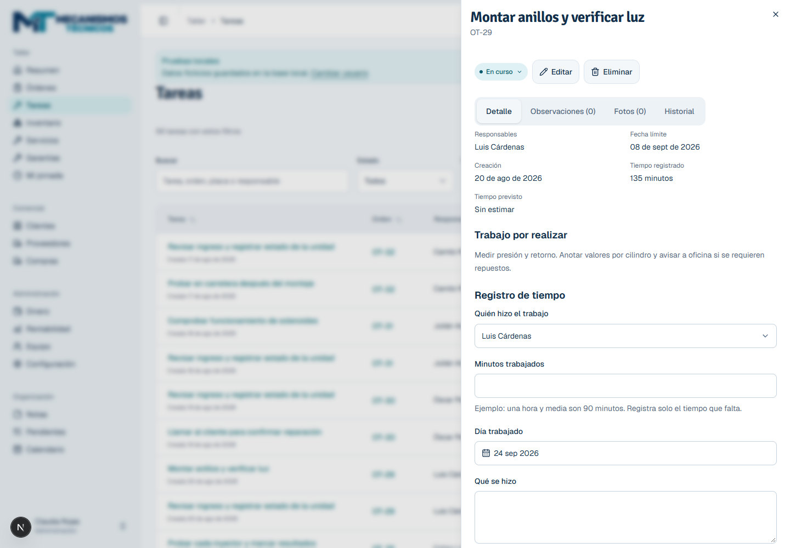

# Rentabilidad conectada: revisión e implementación

24 de septiembre de 2026 · Mecanismos Manager · entorno local con datos ficticios.

La dificultad principal era la falta de una relación confiable entre lo vendido y lo que costó hacerlo. Había reportes de márgenes, pero no una misma definición de costo compartida por ventas, órdenes, productos y garantías. La solución implementada usa el trabajo como centro de los costos y la venta como origen del ingreso; la caja conserva su función de mostrar cobros y pagos.

## Modelo que quedó implementado

**Por trabajo o venta:** venta menos devoluciones, repuestos consumidos, tiempo realmente registrado, gastos directos y garantías asumidas. Es lo que ese negocio deja antes de los gastos generales del taller.

**Por mes:** ventas emitidas menos devoluciones del mes, materiales reconocidos, salarios y extras devengados y otros gastos del período. Aquí se descuenta la nómina una sola vez. Las horas atribuidas a cada trabajo sirven para comparar trabajos, y no vuelven a restarse de la nómina mensual.

Ejemplo: una reparación de $1.000.000, con $300.000 de repuestos, $100.000 de trabajo, $50.000 de gastos directos y $50.000 de garantía, deja $500.000 antes de gastos generales. El pago del cliente puede ocurrir después y no cambia ese resultado. Son cifras explicativas, no resultados de la empresa.

## Flujo diario, paso a paso

1. **Recibir el trabajo o registrar la venta.** Las ventas de servicio sin orden ahora crean automáticamente el trabajo y sus tareas. Heredan cliente, categoría y responsables disponibles. Una cotización conserva su vínculo al convertirse en venta.
2. **Registrar el trabajo una sola vez.** El tiempo se puede guardar desde la propia tarea. Los repuestos facturados en una reparación completan únicamente el consumo que falta; se aprovechan consumos y reservas propios anteriores, sin tomar reservas de otros trabajos.
3. **Añadir el gasto desde el trabajo.** “Añadir gasto de este trabajo” solicita concepto, valor, mes y vencimiento. Queda asociado a la orden y en Dinero → Por pagar. Su pago no genera un segundo gasto.
4. **Abrir la garantía desde la venta.** Sus repuestos, horas y gastos afectan el negocio original. Una garantía rechazada que se cobra como trabajo independiente traslada esos costos a la nueva venta, sin duplicarlos. Los casos siguen apareciendo en el seguimiento de garantías.
5. **Consultar el resultado y resolver pendientes.** Resumen muestra el resultado mensual. Rentabilidad agrega los trabajos, sus costos, los cobros pendientes y accesos a los registros correspondientes. Productos, categorías, garantías y el histórico siguen disponibles en pestañas.

## Hallazgos y cambios

| Área revisada | Problema comprobado | Tratamiento implementado |
|---|---|---|
| Resumen | Destacaba dinero disponible y pagos; no respondía cuánto dejó el taller | Resultado mensual separado de caja y deuda |
| Órdenes / ventas | Un servicio podía venderse sin trabajo donde registrar sus costos | Creación automática de orden y tareas; reconciliación explícita de ventas históricas |
| Repuestos / reservas | Facturar una reparación no comprobaba los repuestos usados | Consumo automático de faltantes, agrupación de líneas repetidas y reserva parcial |
| Tareas | Marcar tareas realizadas sin tiempo podía parecer trabajo gratuito | Se señalan tareas sin tiempo; registro directo en la ficha de tarea |
| Tiempo histórico | Una orden cerrada no permitía completar horas faltantes | Administración puede completar tiempos de tareas existentes con auditoría; las unidades ya valoradas siguen bloqueadas |
| Compras / proveedores | Riesgo de tratar el pago de la compra como otro costo al consumir inventario | El material entra por recepción y sale por uso o venta; pagar al proveedor afecta caja |
| Gastos / obligaciones | No tenían relación directa con una orden | Relación opcional con trabajo, accesos desde gasto a orden y registro contextual |
| Nómina / anticipos | Mezclar pago neto, anticipos y horas atribuidas distorsiona la utilidad | Salario y extras antes de descontar cuotas de anticipos; aportes/prestaciones mediante obligaciones |
| Personal inactivo | El estado actual puede ocultar salarios pendientes de meses anteriores | El mes queda provisional cuando falta confirmar la participación de personal inactivo con salario vigente |
| Garantías | Costos separados de productos y categorías | Fuente común de costos, pendientes y resultado; no se atribuye culpa automáticamente al mecánico |
| Devoluciones | Confusión entre devolución de dinero y recuperación de costos | Mostrador recupera inventario; reembolso de reparación conserva el trabajo y los materiales ya usados |
| Anulaciones | Reemitir una reparación podía provocar consumos duplicados | Se conserva el consumo del trabajo y se reutiliza al emitir nuevamente |
| Reconstrucciones propias | Inversión y venta podían quedar desconectadas; no había desglose inmutable | Núcleo, materiales, trabajo y gastos; desglose congelado al valorar y copiado al vender; trazabilidad desde orden a venta actual |
| Fechas | El consumo automático de ventas fechadas antes podía caer en otro mes | Fecha de movimiento financiero de la venta; sin alterar la fecha técnica de creación |
| Costos desconocidos | Ausencia de datos podía aparentar cero; una reversión podía dejar un faltante permanente en el trabajo | Resultado incompleto explícito; reversión completa deja de bloquear el costo de la orden |
| Uso en pantalla | Se debía navegar a otra sección para registrar tiempo; datos dispersos | Tiempo y gastos en contexto, pendientes visibles, búsqueda y paginación |

## Evidencia visual de esta revisión

### Antes: el resumen hablaba de caja

El usuario necesitaba interpretar la liquidez para intentar deducir la rentabilidad. Son preguntas distintas. La separación entre saldo de caja y resultado mensual evita esa inferencia.

### Antes: informes dispersos en una página larga

Había información útil de productos, garantías y equipo, pero faltaba una respuesta inicial y una ruta directa hacia los datos incompletos. Se conservaron estos informes como vistas complementarias.

### Después: resultado y pendientes

El importe incluye la etiqueta “Provisional” y una explicación textual. Las pérdidas no dependen solo del color: conservan el signo y el contexto. Los datos de esta captura son ficticios; no describen el desempeño real de la empresa.

### Después: móvil

Se comprobó un ancho de documento de 390 px para una ventana de 390 px, sin desplazamiento horizontal de página. Las pestañas se distribuyen en filas. Hay etiquetas de campos y estados textuales. Esto no constituye una certificación de accesibilidad: no se hizo una sesión con lector de pantalla ni una prueba de uso con los padres.

### Después: costo conectado a la orden

En una orden temporal se registraron 15 minutos y un gasto de $10.000. La ficha mostró $4.405 de trabajo registrado y $14.405 de costo acumulado, redondeados para mostrar COP. Se volvió a abrir la orden y los importes permanecieron. La prueba y sus registros temporales se eliminaron al terminar.

### Después: tiempo desde la tarea

La captura muestra el formulario en una tarea de ejemplo. En la prueba temporal se guardó tiempo desde la tarea y se verificó al volver a abrirla. Se corrigió también la serialización de la fecha de trabajo: una fecha de calendario ya no se muestra como el día anterior al convertirla a la zona horaria de Bogotá.

## Reglas de interpretación

- El resultado de una venta mira sus costos y garantías **hasta hoy**. Productos y categorías agrupan ventas por fecha de emisión y mantienen esta misma perspectiva. El informe mensual usa **eventos de cada mes**; por eso no debe reconciliarse sumando los márgenes de las ventas emitidas en ese mes.
- En una reparación sin venta, los materiales permanecen como trabajo sin vender. Se reconocen al venderla; un consumo posterior se reconoce cuando ocurre. Al cancelar un trabajo, los materiales no recuperados se reconocen como costo. Salarios y gastos se reconocen en su mes.
- Las garantías asumidas reconocen sus materiales cuando se usan. Si una garantía rechazada se factura posteriormente, pasa al trabajo cobrado; los informes vivos pueden cambiar al completarse esa información.
- Para reconstrucciones propias, el mes de venta reconoce núcleo y materiales. Salarios y gastos externos ya pertenecen a sus meses de realización. El resultado completo de la unidad sí conserva todos estos costos, incluso tras devolverla y venderla de nuevo.
- Anticipos, préstamos, aportes, retiros y transferencias mueven dinero o saldos, sin convertirse automáticamente en ingresos o gastos de rentabilidad.
- Una cifra sin horas, tarifas o costos suficientes permanece incompleta. “Mes revisado” indica revisión de los registros de gestión, no un cierre contable inmutable.

## Datos que aún requieren intervención humana

No se pueden deducir de manera confiable las horas realmente trabajadas, los servicios externos pagados fuera del sistema o los costos antiguos que nunca se registraron. La automatización conecta y calcula los datos; no los inventa.

Para empezar con datos reales basta configurar salarios/tarifas y gastos recurrentes, recibir compras con su costo completo y registrar tiempo y gastos al realizar el trabajo. Las ventas históricas de servicio tienen la acción “Conectar trabajo”. Los repuestos facturados sin consumo tienen “Completar repuestos usados”, con confirmación de que realmente se instalaron. Si venta y orden ya tienen movimientos de repuestos, la vinculación se bloquea hasta reconciliarlos para no duplicar costos.

Los costos antiguos desconocidos y los desgloses de unidades anteriores no se rellenan mediante una migración automática. Las órdenes históricas sin tareas requieren reconciliación administrativa. El estado activo/inactivo de una persona no sustituye un historial contractual; cuando no basta la nómina registrada, el mes se marca para revisión.

Los costos de importación atribuibles deben incorporarse al costo unitario recibido. Si se registran también como gasto corriente, se duplican. No se añadieron reglas tributarias, depreciaciones, cálculos de IVA descontable ni integración contable con Siigo. El alcance sigue siendo control interno de gestión.

## Verificación y entrega

- `pnpm test`: 14 archivos, 68 pruebas aprobadas.
- `pnpm test:integration`: 19 archivos, 123 pruebas aprobadas; incluye 12 escenarios de rentabilidad y una prueba adicional de rollback real de venta, orden, stock y cobro.
- `pnpm typecheck`, `pnpm db:validate` y `pnpm build`: aprobados.
- `pnpm db:verify:fixtures`: inventario, caja y abonos conciliados; 29 órdenes, 56 tareas, 36 ofertas y 3 accesos locales después de limpiar los datos temporales.
- Navegador real: resumen, pestañas de rentabilidad, orden, registro de tiempo, registro de gasto, persistencia al reabrir y móvil de 390 px. React DevTools confirmó el componente y los datos del resultado. Next MCP sin errores de compilación ni ejecución al concluir las revisiones de ficha.
- Dos migraciones aditivas aplicadas únicamente a Supabase local: relaciones de gastos y desgloses de costo; fecha financiera del consumo automático. No se reescribieron registros históricos remotos.
- Entrega en la rama `feature/connected-profitability`. No se publicó ni se modificó la base de producción.

La prueba visual detectó y corrigió claves React repetidas en la ficha. Tras regenerar Prisma se reinició el servidor local para cargar el cliente actualizado y se volvió a comprobar el guardado de gastos. Las pruebas no sustituyen la validación del flujo con los padres ni demuestran la integridad de datos históricos reales.

## Unidades de cambio y reversión

1. **Cálculo y operaciones conectadas.** `profitability-source`, `profitability-query`, `profitability-service`, `sale-work`, servicios de ventas/gastos/tareas/unidades, modelos y migraciones. Pruebas: integración completa 123/123, incluida conciliación entre orden, venta y categoría. El lector anterior y la emisión anterior pueden restaurarse juntos sin borrar los movimientos ya auditados. Mantener las columnas aditivas evita pérdida de datos.
2. **Uso diario en contexto.** `features/profitability`, entrada de gasto desde orden, entrada de tiempo desde tarea, enlaces de venta y gastos, resumen y serialización de fechas. Prueba: navegador con guardar/reabrir más build de producción. Se puede retirar la nueva presentación manteniendo los datos y la API; no exige revertir transacciones.

Para un despliegue futuro: aplicar primero las migraciones al destino verificado, regenerar Prisma y desplegar el código. No eliminar gastos, consumos ni tiempos para revertir una versión.
